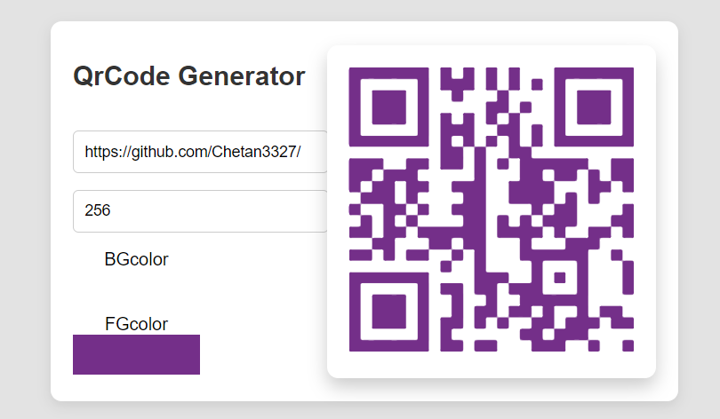

<!-- ABOUT THE PROJECT -->
# QrCode App


The **QR Code Generator App** is a web application that allows users to create QR codes. Users can input a value, choose background and foreground colors, and adjust the size of the QR code. The app utilizes the `react-qr-code` library to generate QR codes based on user inputs.

Use the `README.md` to get started.

<!-- BUILT WITH -->
# Built With

The Tech Stacks used are:

<div align="center">
  <a href="https://skillicons.dev">
      
  </a>
</div>

## Installation

1. Clone the repository to your local machine:

   ```bash
   git clone https://github.com/Chetan3327/qr-code-app.git
   ```
2. Navigate to the project directory:

   ```bash
   cd qr-code-app
   ```
3. Install dependencies:

   ```bash
   npm install
   ```

<!-- CONTACT -->
# Contact

Name: Chetan Chauhan - chauhanchetan12789@gmail.com

Project Link: https://qr-code-app-3327.netlify.app/